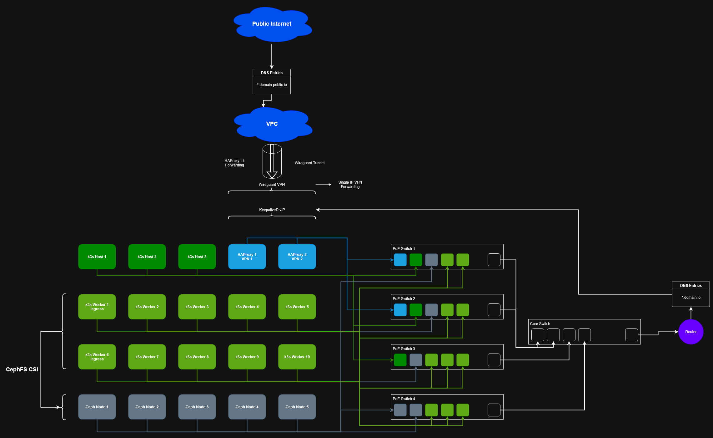

# Design

To enable a slightly fault tolerant system we need to take care of redundancy. Of course in a simple home enrivonment we cannot go enterprise-grade with separate power lines, battery packs and so on but the setup will tolerate some hardware failures.

> ⚠️ Production note:

> - We also would have to separate the hosts in different availability zones, provide separate power lines on different circuits, make sure that power failures are softened with PSUs, cooling is redundant, network connectivity is redundant (incl. power supply) and access is restricted

The connection to the CSP is (as of now) a single VPS but even if it fails the local connections will remain stable and all services keep running. Maybe in the future I will scale the VPS and register it to my public domain for a simple HA round-robin access.

All other components are redundant and can tank at least one hardware blackout per domain:

- Storage (5x Ceph nodes)
- Access/Routing (2x LB nodes)
- Workloads (10x Kubernetes worker nodes)
- Managements (3x Kubernetes master nodes)
- Network (4x PoE Switches)

> Production note:

> - Ceph storage in production must be carefully planned to meet the desired availability, storage and network consumption. Due to its SDS nature, the network exhaustion is a bit different from legacy/traditional storage systems (NAS, SAN)

The system has focus on a few specific areas:

- making sure that a switch failure does not bring down the system
    - we distribute our network connections across multiple switches
- making sure that a RPI failure does not bring down the system
    - every domain (storage, routing, management and workloads) is redundant
- it is accessible from a public network (the internet)
    - I use a VPS from a CSP in Switzerland
- it is accessible from a local network (my home network)
    - I use a split DNS approach with TLS bridging/offloading on the LB nodes
- it is secure enough to avoid general attacks
    - all local communication is done with a 4096bit RSA PKI
    - all public communication is done with an official TLS certificate from my CSP of choice
    - incoming traffic from the internet is rate limited, maxconn limited and throttled per exposed service
- it does provide automated storage provisioning
    - we use Ceph and its CSI-driver to enable storage class based creations of PVCs to connect to our CephFS
- storage must be redundant
    - all Ceph OSDs can carry a full blackout of a RPI
    - the Ceph manager daemon is redundant
    - the Ceph monitors are redundant
- workloads must be able to move across nodes if a hardware failure occurs
    - Pod in the Kubernetes cluster can move between 10x nodes

## Overview

This is a general overview of what is about to be built (right-click and open in new tab to enlarge image):

