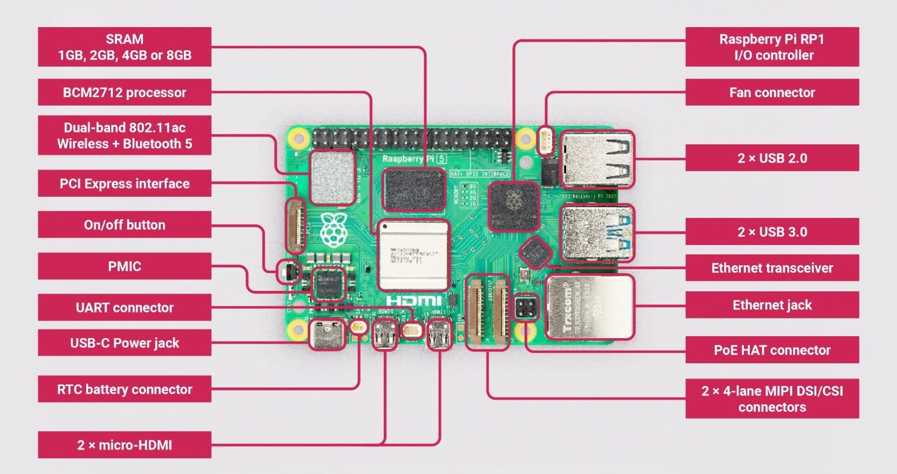
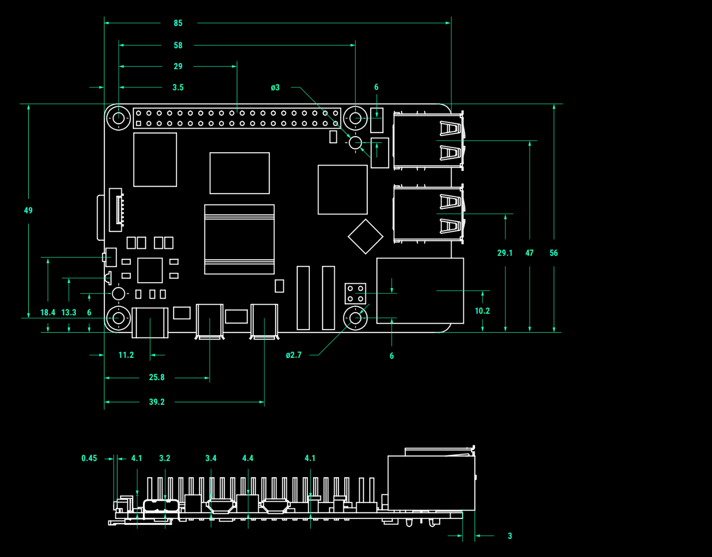

# Raspberry Pi's

The core of this project is the SBC (single board computer) called [Raspberry Pi](https://www.raspberrypi.com/).

It is capable of running a full-fledged Linux OS and is equipped with an ARMv8-A (64bit) processor (BCM2712, Cortex-A76, 4x Cores, up to 2.4GHz) and (in the version I bought) has 8GB DDR4 of memory.



Due to its small dimensions it is the perfect hardware to realize smaller projects (all dimensions in mm):



## Usage

To use the RPI we must take care of three things:

- power supply
    - here I use [PoE HATs](https://www.waveshare.com/catalog/product/view/id/6434/s/poe-hat-g/category/37/) to directly supply power from a network switch
    - it does connect via the GPIO pins on the RPI
- local storage for the OS
    - a simple microSD card is sufficient
    - I used a 128GB card with the U3 and A2 [performance indicators](https://www.kingston.com/en/blog/personal-storage/memory-card-speed-classes)
- access
    - a SSH connection from another Linux machine is sufficient
    - we do not use a graphical user interface (GUI) since it unnecessarily eats up memory we have a better use for

> If you want to have more information about the RPI please check out [the respective website](https://www.raspberrypi.com/documentation/)

<hr>

#### The Linux OS

Since we do not need a GUI I chose the lite version of the official RPI Linux OS called "Raspberry Pi OS Lite (64bit)" and flashed it onto the microSD cards of all my RPIs.

I used the official tool called ["Raspberry Pi Imager"](https://www.raspberrypi.com/software/) and did three crucial things:

- I entered a hostname according to my [inventory of Ansible](https://github.com/hyrsh/homelab-rpi/blob/main/ansible/inventory.yml)
- I entered an admin SSH public key for initial access *(we call it admin.private)*
- I entered an admin user that goes with said SSH public key *(we call it admin.public)*

> To generate a SSH key pair I used the default command ["ssh-keygen"](https://www.ssh.com/academy/ssh/keygen) on my Linux workstation. I saved the private key in a secure location and entered the public key into the user interface of the Raspberry Pi Imager

<empty>

> ⚠️ Production note:

> The OS distribution of hosts is dependent on your setup and can range from [PXE](https://protechgurus.com/vmware-virtual-machine-using-pxe-boot-wds/) to [Golden Images](https://www.redhat.com/en/topics/linux/what-is-a-golden-image) to [Kickstart](https://en.wikipedia.org/wiki/Kickstart_(Linux)) deployments. The initial SSH access should not be a human entity but a robot account that automates user management later on via pipelines and/or IAM policies, rules, groups and domain connections

After we installed the OS on the microSD card we can plug it in and connect the ethernet cable (which also supplies power due to PoE). Within a few seconds we can reach the host via SSH from our workstation. The SSH keypair we created will now be used:

```shell
ssh -i <path/to/admin.private> <user>@<host>
```

The "-i" flag of SSH uses the given file to identify us with the user we provide against the host we chose and if it matches the public key entry in the users home directory ".ssh/authorized_keys" the access will be granted.

 For example if we want to connect to a host called "myhost" with the user "myuser" and a private keyfile being located under "/opt/mykeys/myuser.private" the SSH command would look like this:

```shell
ssh -i /opt/mykeys/myuser.private myuser@myhost
```

> ⚠️ Production note:

> Users <span style="color:red"><b>must not</b></span> have direct access via SSH to machines running in any stage. The best practice is to setup a jumphost that requires the user to strongly authenticate (Domain + MFA) and is strictly regulated through corporate administration. On that jumphost only minimal permissions are granted and SSH connections per stage are only allowed from that source IP. Consider setting up multiple jumphosts per staged environment to address the "separation of concerns" concept and minimize the blast radius in case of a breach

<hr>

#### Automation

The distribution of a central SSH key to get administrative access to all of the hosts poses a security risk but is necessary at first.

To fix that we write an [Ansible role](https://docs.ansible.com/ansible/latest/playbook_guide/playbooks_reuse_roles.html) to add an "ansible" user with a different key for each host and remove our initial user key. To have an emergency access we set a password for our initial user that is complex enough to withstand brute-force attacks.

> We could have done that while installing the OS on the microSD cards via the RPI Imager software but I wanted to keep the configuration as much as possible within Ansible

After that all your hosts can be left untouched and are ready to be configured using Ansible.

> There is one exception since we have to work with hardware (SSDs for Ceph) and have to be <span style="color:red"><em>really careful</em></span> what we are doing. The wiping of the filesystem and setting of the GPT partition for each SSD will not be automated with Ansible to avoid a cataclysmic outcome in case of a human error