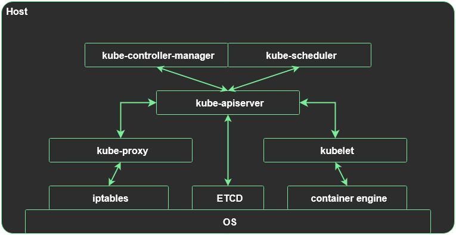

# Kubernetes overview

This is a simple overview of Kubernetes (or short k8s). It is stongly recommended to make yourself familiar with [containers](01_containers.md).

Kubernetes is an orchestrator engine for containers. With its clever design and ability so scale horizontally across multiple hosts it does create a basic infrastructure level with a new standard of how we deploy applications.

It does run ontop of a Linux OS (I ignore Windows on purpose) as services that reside in userspace.

The deployment of an application is described in a standardized manner in form of a YAML or JSON file. This YAML file contains all information the cluster must know to run it.

When Kubernetes gets such a YAML/JSON file it can choose where to run that application. This form of scheduling works only across member nodes of the cluster (worker nodes) that are authenticated and authorized to recieve orders.

All YAML/JSON files are sent to the Kube-Apiserver which is a central component of Kubernetes.

<hr>

## Architecture

Kubernetes in its smallest setup can be installed on a single host. In the vanilla version we have 6x binaries that make up the whole system:

|Name|Description|Domain|
|-|-|-|
|Kube-Apiserver|Central component to handle all API requests|Master Plane|
|Kube-Scheduler|Responsible to distribute Pods across nodes|Master Plane|
|Kube-Controller-Manager|Permanently checks & updates states in the cluster|Master Plane|
|ETCD|Database for the whole cluster state|Master Plane|
|Kubelet|Agent for container runtime management|Worker Plane|
|Kube-Proxy|Agent for network management|Worker Plane|

|Tasks|
|-|
|The API server is the only component that is allowed to talk to ETCD. All other components need to send an API request to the API server if they want any information about the desired or current state of the cluster|
|The controller-manager watches API server events with control loops to handle state changes|
|The kube-proxy watches the API server for service events and triggers changes in e.g. iptables|
|The scheduler decides where a container can run and plays that decision back to the API server|
|The kubelet watches the API server for scheduler decisions and talks to the container engine|



> ⚠️ Production note:

> Running a standalone Kubernetes node is not production-grade. The minimal default setting for a production cluster is 3x master nodes and at least 3x worker nodes. If scaling beyond 100x worker nodes a switch from traditional kube-proxy CNIs to [Cilium CNI](https://cilium.io/) is also advisable regarding performance.

<hr>

## Dataflow

As you can see in the architecture picture everything has to go through the API server. This is by design to maintain and enforce standards that are crucial in a distributed system.

Whenever we want to do anything in Kubernetes we **must** communicate with the API like all other components of the system itself.

This does imply that the API server (and the database it uses to store all information; here ETCD) is an extremely busy service since all API data flows must pass through it.

<hr>

## Setup (Bootstrapping Theory)

All Kubernetes flavours have the same order of bootstrapping:

1. Setup the database with its certificates (here we use ETCD)
    - Cluster the database if you want to go for a HA setup
2. Setup the Control Plane (API Server, Controller Manager, Scheduler)
    - If clustered, do this on all master nodes with respective configs
    - If you do want the Control Plane to carry workloads also install the kubelet
    - If you don't want to use a kube-proxy replacement, install kube-proxy
3. Setup worker nodes (kubelet, optional kube-proxy)
4. Join worker nodes to the Control Plane
    - If done manually you have to approve the CSR on a master node for each worker

You can run Kubernetes with only one master node that carries the Control Plane (API Server, Controller Manager, Scheduler) and the worker components (kubelet, optional kube-proxy).

This setup would be a valid setup regarding Kubernetes internals but of course it would not be highly available.

<hr>

## Container Engine & Image pulling

Since Kubernetes uses some container engine in the background (aside from Docker the new standard is [containerd](https://containerd.io/)) it has to adhere to some basics the engine requires to start up a container image. The container engine and the kubelet work together tightly.

> Image pulling is a download operation of a container image from a registry.

|Task|Description|Responsible service|
|-|-|-|
|Image pulling|Kubernetes must pass the image pulling command to the container engine|Kubelet|
|Image caching|All pulled images are held locally on the host until a storage threshold is reached|Container Engine|
|Image pruning|All locally cached images that are not in active use are deleted when threshold is reached|Kubelet|
|Container start|Only containers with pullable or cached images can be started|Kubelet|
|Container stop|A regular stop can be called via Kubernetes API commands|Kubelet|
|Container kill|If the stop command does not work the engine must do it|Container Engine|

<hr>

## Usage

If everything on the host is installed we have another specific binary of Kubernetes called [kubectl](https://kubernetes.io/docs/reference/kubectl/) that is not part of the runtime services but is a central part of the ecosystem. It can be downloaded separately but must be in a +/- range of 2 when it comes to minor versions of the Kubernetes API server.

> e.g. kubectl v1.30.0 can be used with API servers ranging from v1.28.0 to 1.32.0

This binary is a REST wrapper for the Kubernetes API calls that makes interaction with Kubernetes more human-readable. It also has some benefits of parsing files and see if they are correct in terms of format and syntax regarding Kubernetes specifications.

Its authentication is done via a [kubeconfig](https://kubernetes.io/docs/concepts/configuration/organize-cluster-access-kubeconfig/) file (default path is ~/.kube/config) and it contains the API endpoint and the credentials of our user for Kubernetes.

> &#9888 Production note:

> In a production environment users are not directly authenticated via native RBAC service accounts of Kubernetes. There are integrations with domain specific accounts that can be used to talk to the Kubernetes API (see [Dex](https://github.com/dexidp/dex), [Rancher](https://ranchermanager.docs.rancher.com/how-to-guides/new-user-guides/authentication-permissions-and-global-configuration/authentication-config/configure-active-directory), [Keycloak](https://www.keycloak.org/)).

<empty>

> Only cluster administrators should be allowed to directly talk to the Kubernetes API. Everyone else should passively interact with the clusters using tools like [ArgoCD](https://argo-cd.readthedocs.io/en/stable/), [Flux](https://fluxcd.io/).

With kubectl we can interact with a Kubernetes cluster and not only get information but put new information in.

<hr>

## Remote Usage

The kubectl binary and its configuration can be used on any host that reaches the given Kubernetes API server.

`kubeconfig at ~/.kube/config`
```YAML
apiVersion: v1
clusters:
- cluster:
    certificate-authority-data: <redacted> #public certificate of your k8s API server
    server: <YOUR API SERVER IP> #IP or URL of your k8s API server
  name: default #cluster name is arbitrary
contexts:
- context:
    cluster: default #cluster from the "clusters:" list
    user: default #user from the "users:" list
  name: default #context name is arbitrary
current-context: default #currently used context
kind: Config
preferences: {}
users:
- name: default #reference to the kubeconfig user --> not the RBAC service account
  user:
    token: <redacted> #RBAC service account token
```

I [downloaded the kubectl binary](https://kubernetes.io/docs/tasks/tools/install-kubectl-linux/#install-kubectl-binary-with-curl-on-linux) according to my cluster version and created a kubeconfig file on my Ansible workstation.

In many cases it would be sufficient to just copy the kubeconfig from k3s (at /etc/rancher/k3s/k3s.yaml) to our machine but [there is one thing that I really don't like about that](ext_info/kubeconfig.md).

But I created a "second admin". I logged into one of my k8s masters (e.g. hl-master-01) with SSH and created a service account with a corresponding ClusterRoleBinding entry:

`On your k8s master of choice`
```shell
kubectl -n kube-system create sa my-remote-admin
```
This creates a service account called "my-remote-admin" in the namespace "kube-system". I chose the namespace because it is an admin account and (at least to me) all critical stuff is handled in "kube-system".

Now you have to edit the always existing ClusterRoleBinding "cluster-admin".
```shell
kubectl edit clusterrolebinding cluster-admin
```
`Change it to fit your account (e.g. "kube-system", "my-remote-admin")`
```YAML
apiVersion: rbac.authorization.k8s.io/v1
kind: ClusterRoleBinding
metadata:
  annotations:
    rbac.authorization.kubernetes.io/autoupdate: "true" #default value
  creationTimestamp: <generated by your k8s api server>
  labels:
    kubernetes.io/bootstrapping: rbac-defaults #default value
  name: cluster-admin #default value
  resourceVersion: <generated by your k8s api server>
  uid: <generated by your k8s api server>
roleRef:
  apiGroup: rbac.authorization.k8s.io #default value
  kind: ClusterRole #default value
  name: cluster-admin #default value
subjects:
- apiGroup: rbac.authorization.k8s.io #default value
  kind: Group #default value
  name: system:masters #default value
- kind: ServiceAccount #we use a service account
  name: my-remote-admin #name of your created service account
  namespace: kube-system #namespace you created the account in
```

Next you have to create a secret that holds a valid token for your account to put in your kubeconfig.

On your master of choice create a file and write the skeleton of a **permanent** token secret to it:

`e.g. vim mysecret.yaml`
```YAML
apiVersion: v1
kind: Secret
metadata:
  annotations:
    kubernetes.io/service-account.name: my-remote-admin
  name: my-remote-admin-secret
  namespace: kube-system
type: kubernetes.io/service-account-token
```

> &#9888 Production note:

> This is a legacy approach to create permanent tokens that are valid until manual deletion. <span style="color:red">Be very careful if you want that at all</span>. The recommended way to authenticate via API tokens is [described here](https://kubernetes.io/docs/concepts/security/service-accounts/#get-a-token).

> Keep in mind that the token is only as strong as your RBAC configuration! If given admin rights a leak is equal to a full cluster exposure. If the token is only allowed to read in a specific namespace you are not in any real danger.

Now apply the secret (optional: delete the file afterwards to keep things clean):

```shell
kubectl apply -f mysecret.yaml
```

After applying the secret the API server will populate new fields to the secret and fill them with valid data.

To inspect the secret and get the token we print it to stdout:

```shell
kubectl -n kube-system get secret my-remote-admin-secret -o yaml
```
`Output`
```YAML
apiVersion: v1
data:
  ca.crt: <YOUR API SERVER PUBLIC CA>
  namespace: <YOUR NAMESPACE>
  token: <THE TOKEN WE WANT>
kind: Secret
metadata:
  annotations:
    kubernetes.io/service-account.name: my-remote-admin
    kubernetes.io/service-account.uid: <YOUR UID>
  creationTimestamp: <TIMESTAMP>
  labels:
    kubernetes.io/legacy-token-last-used: <LEGACY TIMESTAMP>
  name: my-remote-admin-secret
  namespace: kube-system
  resourceVersion: <NUMBER>
  uid: <UID OF THE SECRET>
type: kubernetes.io/service-account-token
```

All data fields in a k8s secret are base64 encoded so we have to decode the token value first before we put it in our kubeconfig:

`Copy the token string, I refer to it as $TOKEN`
```shell
echo -n $TOKEN | base64 -d
```

The "-n" flag prevents a newline to be added after the output. Copy the output to your kubeconfig at the stanza "token:".

`One-liner for token extraction and decoding`
```shell
kubectl -n kube-system get secret my-remote-admin-secret -o yaml | grep "token: " | awk '{print $2}' | base64 -d
```

`kubeconfig at ~/.kube/config`
```YAML
apiVersion: v1
clusters:
- cluster:
    certificate-authority-data: <redacted> #public certificate of your k8s API server
    server: <YOUR API SERVER IP> #IP or URL of your k8s API server
  name: default #cluster name is arbitrary
contexts:
- context:
    cluster: default #cluster from the "clusters:" list
    user: default #user from the "users:" list
  name: default #context name is arbitrary
current-context: default #currently used context
kind: Config
preferences: {}
users:
- name: default #reference to the kubeconfig user --> not the RBAC service account
  user:
    token: <redacted> #<----------- TOKEN GOES HERE
```

Now you can use your kubeconfig on your Ansible workstation.

```shell
hyrsh@workstation:~# kubectl get nodes
```
`Output`
```YAML
NAME           STATUS   ROLES                       AGE   VERSION
hl-master-01   Ready    control-plane,etcd,master   17d   v1.33.5+k3s1
hl-master-02   Ready    control-plane,etcd,master   17d   v1.33.5+k3s1
hl-master-03   Ready    control-plane,etcd,master   17d   v1.33.5+k3s1
hl-worker-01   Ready    <none>                      17d   v1.33.5+k3s1
hl-worker-02   Ready    <none>                      17d   v1.33.5+k3s1
hl-worker-03   Ready    <none>                      17d   v1.33.5+k3s1
hl-worker-04   Ready    <none>                      17d   v1.33.5+k3s1
hl-worker-05   Ready    <none>                      17d   v1.33.5+k3s1
hl-worker-06   Ready    <none>                      17d   v1.33.5+k3s1
hl-worker-07   Ready    <none>                      17d   v1.33.5+k3s1
hl-worker-08   Ready    <none>                      17d   v1.33.5+k3s1
hl-worker-09   Ready    <none>                      17d   v1.33.5+k3s1
hl-worker-10   Ready    <none>                      17d   v1.33.5+k3s1
```

<hr>

## Kubernetes primitives

In a vanilla Kubernetes installation we have native API objects that are embedded in the Kubernetes API server. These native objects are called "primitives".

Here are the most basic ones and a simple description of what they do:

|Name|Description|Usage|
|-|-|-|
|Pod|The smallest runtime object that holds information of the container and its image|Used for single or batch jobs that have a finite operation time|
|Deployment|Manages one or more pods and adds functionalities like auto-restart and horizontal scaling|Standard runtime primitive that should always be used|
|DaemonSet|Manages pods and automatically scales them with 1x pod per active worker node|Should only be used if a service must run on every node|
|StatefulSet|Manages pods and relies on a specific naming convention and restart behaviour|Used for legacy applications that rely on static connection strings|
|ConfigMap|Stores structured data|Used to configure applications|
|Secret|Stores structured data base64 encoded|Used to store credentials for applications to consume (can be explicitly handled with RBAC)|
|Service|Static vIP connection to one or more pods|Used to establish a stable link for addressing a running pod|
|EndPoint|Part of the Service primitive|Stores information about pod endpoints (IP + port)|
|Namespace|Logical area that holds primitives|Used to separate primitives and permissions|
|Role|RBAC description of what one can do with the Kubernetes API (bound to namespace)|Used to describe permissions or permission sets|
|RoleBinding|Binding of a user to a Role primitive (bound to namespace)|Used to map users to authorization when interacting with the Kubernetes API|
|ClusterRole|RBAC description of what one can do with the Kubernetes API (cluster wide)|Used to describe permissions or permission sets|
|ClusterRoleBinding|Binding of a user to a Role primitive (cluster wide)|Used to map users to authorization when interacting with the Kubernetes API|
|PV|Description of a storage endpoint (e.g. NFS, Ceph)|Used to connect Kubernetes to external storage|
|PVC|Object to be consumed by a pod to mount storage|Used to bind existing or dynamic PV objects to a pod|
|ServiceAccount|User account in Kubernetes|Used to authenticate and authorize against the Kubernetes API server|

> Primitives are normally bound to a namespace with a few exceptions. Namespaces are areas we use to group our applications and settings to maintain control and an overview.
