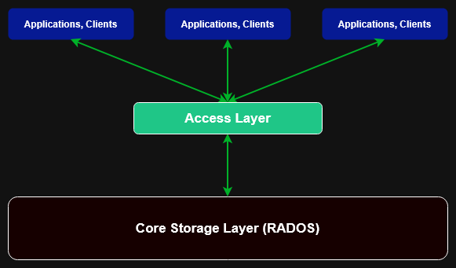
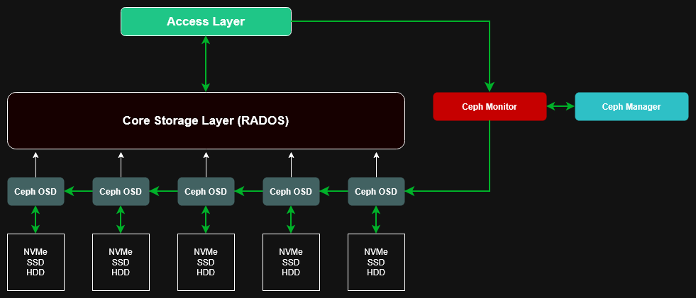

# Ceph overview

[Ceph](https://ceph.io/en/) is a open-source software-defined-storage (SDS) system that runs on Linux and provides storage for applications and hosts.

The reason it is called "software defined" is because of the way applications see and use [Ceph](https://ceph.io/en/) storage. It is not like e.g. a hard drive that can directly be accessed by your application.

It is a uniform layer of creating a storage pool that is accessible via network calls that are managed by the control software of [Ceph](https://ceph.io/en/).

You can think of it as a [NAS](https://en.wikipedia.org/wiki/Network-attached_storage)/[SAN](https://en.wikipedia.org/wiki/Storage_area_network) solution that handles its overall capacity of storage in the background and its access very differently.

It is all based on a layered approach for abstracting the raw storage and how to access it.

The base of storage in Ceph is the [RADOS](https://ceph.io/assets/pdfs/weil-rados-pdsw07.pdf) (**R**eliable **A**utonomic **D**istributed **O**bject **S**tore) Layer.

## Architecture (simplified)

The architecture of Ceph can be divided into 2x parts:

- How the access layer is built?
- How the storage layer is built?

We need a pool of storage and some way to make it accessible. This is a simple way to look at it.

If you want to dive into the beautiful world of Ceph just [follow the white rabbit](https://docs.ceph.com/en/latest/start/). The system can be fine-tuned to fit every organization and its needs for storage [up to a scale far beyond normal capacities](https://indico.cern.ch/event/948465/contributions/4323672/attachments/2247386/3811926/CHEP2021_%20CephFS%20+%20EOS%20(3).pdf).

### Access Layer

The access layer currently has 4x ways of interacting with the storage layer:

|Name|Description|Domain|
|-|-|-|
|LIBRADOS|Library for programmatically access the RADOS layer|Applications|
|RGW|A S3 and Swift compatible interface|Applications|
|RBD|A block device service|Hosts|
|CephFS|A POSIX service|Hosts, Containers|

> The RGW and RBD service both use LIBRADOS to access the RADOS layer

You can run a ceph cluster without any of these access services. It would not make any sense but it does show that all of these services are independent from each other and you do not need to configure all of them. Only the ones you want/need.

### Storage Layer

The storage layer consists of a fixed amount of Linux services called "[daemons](https://en.wikipedia.org/wiki/Daemon_(computing))". These daemons have specific jobs they must take care of to create and maintain the [RADOS](https://ceph.io/assets/pdfs/weil-rados-pdsw07.pdf) layer.

`Most basic Ceph setup`

There are several daemons that we need to understand and how much of them we need in a robust (high-available) setup:

|Name|Task|Amount|
|-|-|-|
|[Ceph Monitor](https://docs.ceph.com/en/latest/rados/configuration/mon-config-ref/#monitor-config-reference)|Cluster state maps, authentication of clients|3|
|[Ceph Manager](https://docs.ceph.com/en/latest/mgr/#ceph-manager-daemon)|Metrics, health and provides a dashboard (WebUI)|2|
|[Ceph Metadata Server](https://docs.ceph.com/en/latest/cephfs/add-remove-mds/#cephfs-add-remote-mds)|Stores metadata for CephFS|2|
|[Ceph Object Storage Deamon](https://docs.ceph.com/en/latest/rados/configuration/storage-devices/#rados-configuration-storage-devices-ceph-osd)|Attached to a storage device (e.g. SSD) to act as [logical disk](https://en.wikipedia.org/wiki/Logical_disk)|5 - infinite|
|[Ceph Rados Gateway](https://docs.ceph.com/en/latest/radosgw/#object-gateway)|Object storage interface for S3 and Swift|2|

## Manual labor

The fact that we only look at a total of 5x Ceph nodes and working very closely to hardware (SSDs) I decided to do setup the initial cluster by hand and document every step I take.

If there are automation steps that are not dangerous for the system **after it was brought to life** I will create the respective roles for Ansible.
