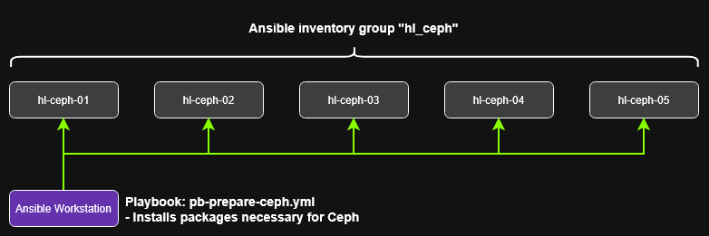
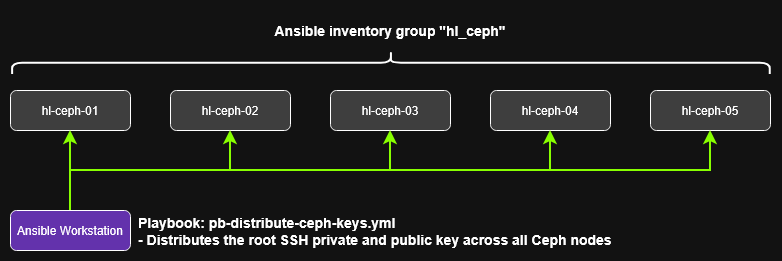
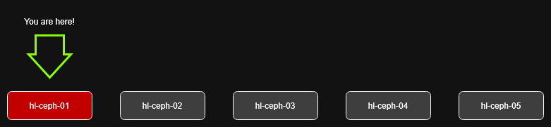
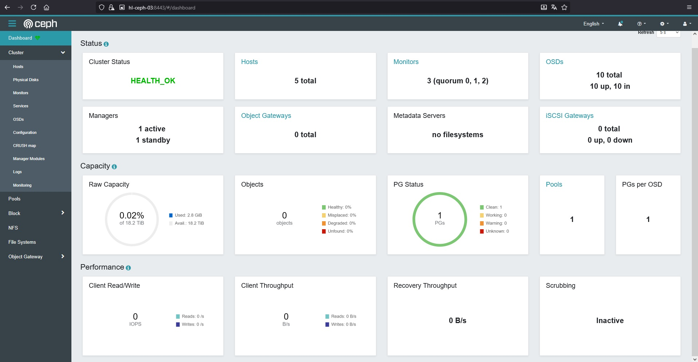

## Bootstrapping the initial cluster

First we have to pick a initial "master" node that gives birth to some crucial information that we later need for all other nodes. This information is entered in our Ansible vault to keep it safe and make it accessible for eventual roles in the future.

I pick my host "hl-ceph-01" as initial master node. At the time of writing it has the IP "192.168.1.30".

<hr>

## Preparation of nodes

To make all nodes capable of joining the ceph cluster we must install some packages before anything. I also install the ceph-management package "cephadm" on all nodes to be able to switch admin nodes if another one fails.

This can be rolled out with the Ansible playbook "pb-prepare-ceph.yml". If you have cloned this repository navigate to the "./ansible" directory and execute the playbook.

`Navigate to the ./ansible directory`

```shell
git clone https://github.com/hyrsh/homelab-rpi && cd homelab-rpi/ansible
```

`Install packages on all nodes`

```shell
ansible-playbook -J -i inventory.yml -e op_mode=install playbooks/pb-prepare-ceph.yml
```

The playbook expects a vault file at "./vault/av_homelab" and executes the run on hosts in the group "hl_ceph" so be aware that you may have to change that if you have custom paths/groups.



Wait for the Ansible playbook to finish and check for errors.

> Important note:

> - I use the root user within my Ceph installation which some may find too dangerous but these nodes are never exposed to anything else than my local k8s workers. In addition they have an internal SSH key for root that is only present on these 5x nodes. Ansible already has root access.

Next we generate a SSH key for the root user to be used accross our Ceph nodes. On your initial Ceph master node (I use hl-ceph-01) change to the root user and create the keys.

`Generate keys`

```shell
root@hl-ceph-01:~# ssh-keygen
```

Confirm with 2x enter for an empty passphrase.


`Convert keys to base64 to be handled better`

```shell
cat /root/.ssh/id_ed25519 | base64 -w0
cat /root/.ssh/id_ed25519.pub | base64 -w0
```

Save both outputs in your Ansible vault under "vault.ceph.ssh_key_private" and "vault.ceph.ssh_key_public".

`ansible-vault edit vault/av_homelab`

```yaml
vault:
  ceph:
    ssh_key_private: "<YOUR VALUE>"
    ssh_key_public: "<YOUR VALUE>"
```

Now you can execute the Ansible playbook "pb-distribute-ceph-keys.yml".

```shell
ansible-playbook -J -i inventory.yml -e op_mode=install playbooks/pb-distribute-ceph-keys.yml
```



After that connect to your master node (in my case "hl-ceph-01") and try to reach all other nodes by SSH.

```shell
root@underwood:~# ssh -i $SSHPRIV ansible-admin@hl-ceph-01
ansible-admin@hl-ceph-01:~ $ sudo -i
root@hl-ceph-01:~# ssh hl-ceph-02
root@hl-ceph-02:~#
```

If this succeeds for all your nodes you have setup all SSH keys correctly.

> Info:

> - if there is a prompt for "The authenticity of host (...)" is shown answer with yes. This is a security warning if you can trust this host and want to add its identity (fingerprint hash) to your list of trusted endpoints. Since this is a homelab we know our hosts and enter "yes"

> - in a production environment if we do not know who controls the unknown host it is advised to enter "no" and re-check who set it up and controls it

If all connections work and all packages are installed you are ready to setup your first node in Ceph.

<hr>

## Setup first monitor

We use the "cephadm" CLI command "bootstrap" to initialize our first monitor on our first master node (I chose hl-ceph-01 with IP 192.168.1.30).



```shell
root@hl-ceph-01:~# cephadm bootstrap --mon-ip 192.168.1.30
```

This command bootstraps the first cluster monitor and sets some initial configuration that is necessary for Ceph to function properly. It also downloads the Ceph container images which can take a while (depending on your internet bandwidth).

After the command completes it will display some initial information about your dashboard login (e.g. https://hl-ceph-01:8443). Write that down and login. You will be asked to change your initial password. Do that and save it in a safe location (e.g. [KeePass](https://keepass.info/download.html)).

Now you must copy the newly generated Ceph SSH key to all other hosts because the Ceph CLI does use different SSH keys than our system. In my setup this goes like this:

```shell
root@hl-ceph-01:~# ssh-copy-id -f -i /etc/ceph/ceph.pub root@hl-ceph-01
root@hl-ceph-01:~# ssh-copy-id -f -i /etc/ceph/ceph.pub root@hl-ceph-02
root@hl-ceph-01:~# ssh-copy-id -f -i /etc/ceph/ceph.pub root@hl-ceph-03
root@hl-ceph-01:~# ssh-copy-id -f -i /etc/ceph/ceph.pub root@hl-ceph-04
root@hl-ceph-01:~# ssh-copy-id -f -i /etc/ceph/ceph.pub root@hl-ceph-05
```

Now you can work with the Ceph CLI on all nodes.

<hr>

## Add hosts to your cluster

The Ceph CLI can be accessed on your master nodes with "cephadm shell". This starts a container with all Ceph tools and puts you right in the home directory of the containers root user.

At any time your can type "exit" and go back to your system.


`Enter Ceph CLI`

```shell
cephadm shell
```
`Check current hosts in cluster`

```shell
ceph orch host ls
```
`Example output`

```shell
HOST        ADDR          LABELS  STATUS
hl-ceph-01  192.168.1.30  _admin
1 hosts in cluster
```
`Add your hosts`

```shell
ceph orch host add hl-ceph-02
ceph orch host add hl-ceph-03
ceph orch host add hl-ceph-04
ceph orch host add hl-ceph-05
```

I do the system setup as follows:

- hl-ceph-01 Monitor0, OSD0, OSD1, \_admin
- hl-ceph-02 Monitor1, OSD2, OSD3
- hl-ceph-03 Manager0, OSD4, OSD5
- hl-ceph-04 Manager1, OSD6, OSD7
- hl-ceph-05 Monitor2, OSD8, OSD9, \_admin

To keep it brief I abbreviate the labels to e.g. mon0, mgr0, osd0 and so on.

```shell
ceph orch host label add hl-ceph-02 mon1
ceph orch host label add hl-ceph-02 osd2
ceph orch host label add hl-ceph-02 osd3
ceph orch host label add hl-ceph-03 mgr0
ceph orch host label add hl-ceph-03 osd4
ceph orch host label add hl-ceph-03 osd5
ceph orch host label add hl-ceph-04 mgr1
ceph orch host label add hl-ceph-04 osd6
ceph orch host label add hl-ceph-04 osd7
ceph orch host label add hl-ceph-05 mon2
ceph orch host label add hl-ceph-05 osd8
ceph orch host label add hl-ceph-05 osd9
ceph orch host label add hl-ceph-05 _admin
```
`Check hosts again`
```shell
ceph orch host ls

HOST        ADDR          LABELS                 STATUS
hl-ceph-01  192.168.1.30  _admin,mon0,osd0,osd1
hl-ceph-02  192.168.1.31  mon1,osd2,osd3
hl-ceph-03  192.168.1.32  mgr0,osd4,osd5
hl-ceph-04  192.168.1.33  mgr1,osd6,osd7
hl-ceph-05  192.168.1.34  mon2,osd8,osd9,_admin
5 hosts in cluster
```

To prevent an autodeploy of services we want to disable the management functionality:

```shell
ceph orch apply mon --unmanaged
ceph orch apply mgr --unmanaged
```

Now we can choose where we want to deploy our monitors and manger nodes:

```shell
ceph orch apply mon --placement="hl-ceph-01,hl-ceph-02,hl-ceph-05"
ceph orch apply mgr --placement="hl-ceph-03,hl-ceph-04"
```
`Check placements`
```shell
ceph orch ls

NAME           PORTS        RUNNING  REFRESHED  AGE  PLACEMENT
alertmanager   ?:9093,9094      1/1  7m ago     28m  count:1
crash                           5/5  8m ago     28m  *
grafana        ?:3000           1/1  7m ago     28m  count:1
mgr                             2/2  8m ago     8m   hl-ceph-03;hl-ceph-04
mon                             3/3  8m ago     9m   hl-ceph-01;hl-ceph-02;hl-ceph-05
node-exporter  ?:9100           5/5  8m ago     28m  *
prometheus     ?:9095           1/1  7m ago     28m  count:1
```


There are other services deployed but we take care of that later. Now we can start adding OSDs to our storage layer.

<hr>

## Adding OSDs

Before we can handle disks with Ceph we need to prepare them on each host.

`List block devices on e.g. hl-ceph-01`
```shell
root@hl-ceph-01:~# lsblk

NAME        MAJ:MIN RM   SIZE RO TYPE MOUNTPOINTS
sda           8:0    0   1.8T  0 disk
sdb           8:16   0   1.8T  0 disk
mmcblk0     179:0    0 116.2G  0 disk
|-mmcblk0p1 179:1    0   512M  0 part /boot/firmware
`-mmcblk0p2 179:2    0 115.6G  0 part /var/lib/containers/storage/overlay
```

Here we can see that our devices "sda" and "sdb" are listed with 1.8TB. These are the ones we want to prepare.

> Hint: the device "mmcblk0" is our SD card in the RPI and we to not want to touch that!

`Clear partition information`
```shell
fdisk /dev/sda

Welcome to fdisk (util-linux 2.38.1).
Changes will remain in memory only, until you decide to write them.
Be careful before using the write command.

Device does not contain a recognized partition table.
Created a new DOS (MBR) disklabel with disk identifier 0x3a55ce1f.

Command (m for help): d
No partition is defined yet!

Command (m for help): g

Created a new GPT disklabel (GUID: D53FF75F-A836-E84D-BA31-4CF502BC59A5).

Command (m for help): w
The partition table has been altered.
Calling ioctl() to re-read partition table.
Syncing disks.
```

We use the options "d" to delete any partition (in our case I already did it so there wasn't a definition) then we use option "g" to set a GPT disklabel and in the end we use option "w" to write the configuration to the disk.

After that we need to wipe the entire disk clean of anything so Ceph can play with it.

`Use wipefs to clear everything`
```shell
wipefs -a /dev/sda

/dev/sda: 8 bytes were erased at offset 0x00000200 (gpt): 45 46 49 20 50 41 52 54
/dev/sda: 8 bytes were erased at offset 0x1d1c1115e00 (gpt): 45 46 49 20 50 41 52 54
/dev/sda: 2 bytes were erased at offset 0x000001fe (PMBR): 55 aa
/dev/sda: calling ioctl to re-read partition table: Success
```

We have to do this for **every** device we want to be managed by Ceph on **every** host. If anything fails you always repeat the steps. If it fails consistently you can assume that your drive is damaged and you may need to buy a new one.

If we have done that on all RPIs (all disks I cleared were /dev/sda and /dev/sdb) we can add the OSD via the Ceph CLI.

`Enter Ceph CLI`
```shell
cephadm shell
```
`Add OSD per disk and host`
```shell
ceph orch daemon add osd hl-ceph-01:/dev/sda raw
ceph orch daemon add osd hl-ceph-01:/dev/sdb raw
ceph orch daemon add osd hl-ceph-02:/dev/sda raw
ceph orch daemon add osd hl-ceph-02:/dev/sdb raw
ceph orch daemon add osd hl-ceph-03:/dev/sda raw
ceph orch daemon add osd hl-ceph-03:/dev/sdb raw
ceph orch daemon add osd hl-ceph-04:/dev/sda raw
ceph orch daemon add osd hl-ceph-04:/dev/sdb raw
ceph orch daemon add osd hl-ceph-05:/dev/sda raw
ceph orch daemon add osd hl-ceph-05:/dev/sdb raw
```

If everything went well we can look at the setup:

```shell
ceph osd tree

ID   CLASS  WEIGHT    TYPE NAME            STATUS  REWEIGHT  PRI-AFF
 -1         18.19397  root default
 -3          3.63879      host hl-ceph-01
  0    ssd   1.81940          osd.0            up   1.00000  1.00000
  1    ssd   1.81940          osd.1            up   1.00000  1.00000
 -5          3.63879      host hl-ceph-02
  2    ssd   1.81940          osd.2            up   1.00000  1.00000
  3    ssd   1.81940          osd.3            up   1.00000  1.00000
 -7          3.63879      host hl-ceph-03
  4    ssd   1.81940          osd.4            up   1.00000  1.00000
  5    ssd   1.81940          osd.5            up   1.00000  1.00000
 -9          3.63879      host hl-ceph-04
  6    ssd   1.81940          osd.6            up   1.00000  1.00000
  7    ssd   1.81940          osd.7            up   1.00000  1.00000
-11          3.63879      host hl-ceph-05
  8    ssd   1.81940          osd.8            up   1.00000  1.00000
  9    ssd   1.81940          osd.9            up   1.00000  1.00000
```

Now our dashboard should also show the OSDs and a healthy status.



To get an overall state of your cluster you can also check it from your Ceph CLI.

```shell
ceph status

  cluster:
    id:     <YOUR FSID>
    health: HEALTH_OK

  services:
    mon: 3 daemons, quorum hl-ceph-05,hl-ceph-02,hl-ceph-01 (age 59m)
    mgr: hl-ceph-03.vaogpo(active, since 59m), standbys: hl-ceph-04.nrcpex
    osd: 10 osds: 10 up (since 26m), 10 in (since 27m)

  data:
    pools:   1 pools, 1 pgs
    objects: 0 objects, 0 B
    usage:   2.8 GiB used, 18 TiB / 18 TiB avail
    pgs:     1 active+clean
```

<hr>

## TLS for Grafana and Dashboard

We want to use our generated wildcard certificate to be used for the Dashboard and the internal Grafana instance of Ceph (it is builtin so we have to deal with it).

> Super important note:

> - If you use self-signed certificates make sure the SAN field is also provisioned with your wildcard domain. Since 2012 browsers deprecated the fallback to the common name (CN) if a direct URL match is not met ([RFC2818](https://www.rfc-editor.org/rfc/rfc2818#section-3.1), *Server Identity*). The [certificate creation script](https://github.com/hyrsh/homelab-rpi/blob/main/scripts/create-pki/create-certs.sh) I provided does that already. The CN can contain your TLD e.g. "mydomain.io" but at least one SAN field has to have "*.mydomain.io" present if you want to use wildcards. Otherwise browsers will reject the certificate

To make our private certificates work with Ceph we need to do a couple of things:

1. <span style="color:#ADFF2F">Extract the Root CA certificate from our Ansible vault</span>
    - save it to e.g. root_ca.crt on your Desktop or somewhere else
        - `root@myhost:~# ansible-vault view vault/av_homelab`
        - copy the value from "sspki_root_crt"
        - `root@myhost:~# echo "COPIED_VALUE | base64 -d > root_ca.crt`
2. <span style="color:#ADFF2F">Extract the Intermediate CA certificate from our Ansible vault</span>
    - save it to e.g. int_ca.crt on your Desktop or somewhere else
        - `root@myhost:~# ansible-vault view vault/av_homelab`
        - copy the value from "sspki_int_crt"
        - `root@myhost:~# echo "COPIED_VALUE | base64 -d > int_ca.crt`
3. <span style="color:#ADFF2F">Rollout the Server certificate and key to all Ceph nodes</span>
    - use the Ansible role "distribute_ceph_certs" from your Ansible directory
        - `ansible-playbook -J -i inventory.yml -e op_mode=install playbooks/pb-distribute-ceph-certs.yml`
4. <span style="color:#ADFF2F">Change Ceph settings for Grafana</span>
    - use commands in your Ceph CLI from an Ceph admin host (e.g. hl-ceph-01)
        - `cephadm shell`
        - `cd ~` <-- this is where the playbook copied our certificates to
        - `ceph config-key set mgr/cephadm/grafana_crt -i private-srv.crt`
        - `ceph config-key set mgr/cephadm/grafana_key -i private-srv.key`
        - `ceph orch restart grafana`
5. <span style="color:#ADFF2F">Change Ceph settings for the Dashboard</span>
    - use commands in your Ceph CLI from an Ceph admin host (e.g. hl-ceph-01)
        - `cephadm shell`
        - `cd ~` <-- this is where the playbook copied our certificates to
        - `ceph dashboard set-ssl-certificate-key -i private-srv.key`
        - `ceph dashboard set-ssl-certificate -i private-srv.crt`
        - `ceph orch restart mgr`
6. <span style="color:#ADFF2F">Add certificates to our browser</span>
    - depending on your browser add your root_ca.crt & int_ca.crt to the trusted certificates
        - it could be like: Settings > Security > Certificates > Add Trusted Sites
        - after that you can delete the created files

