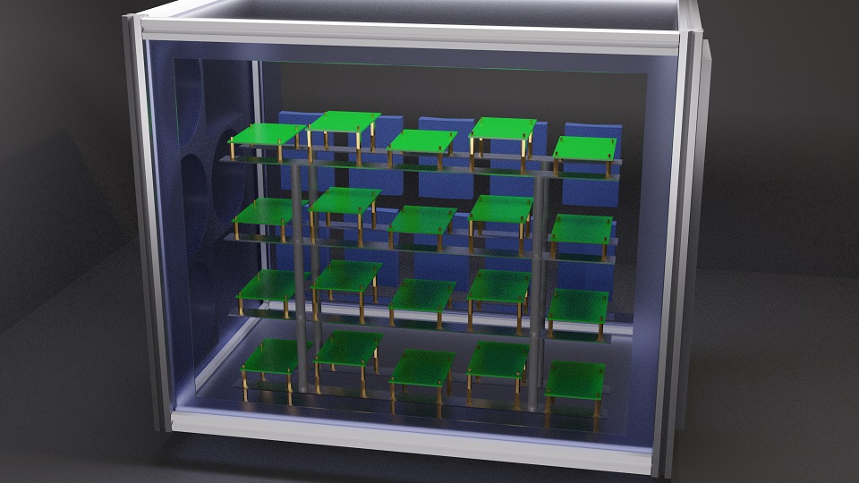
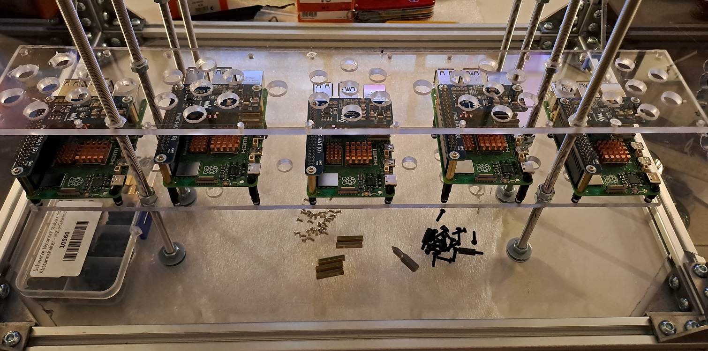
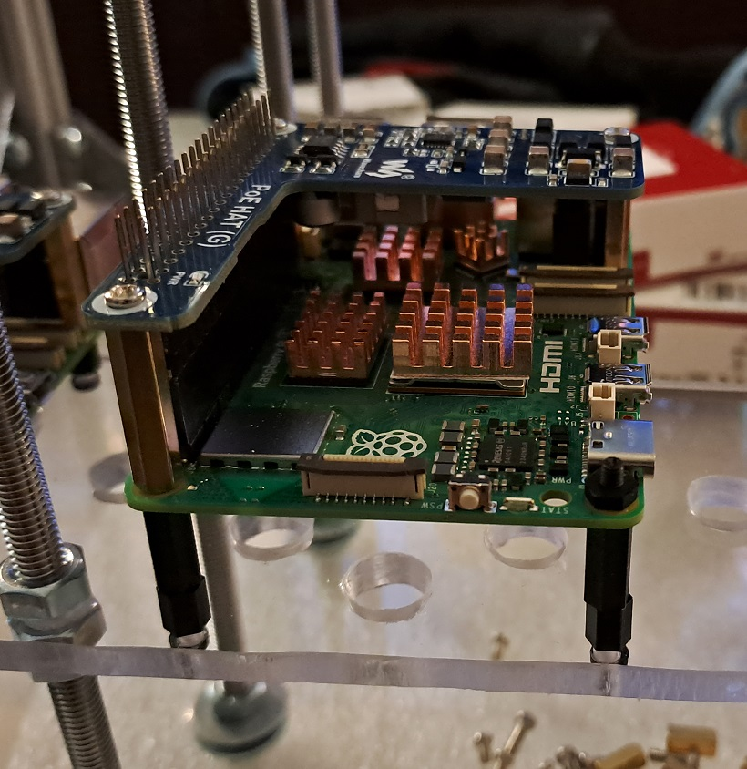
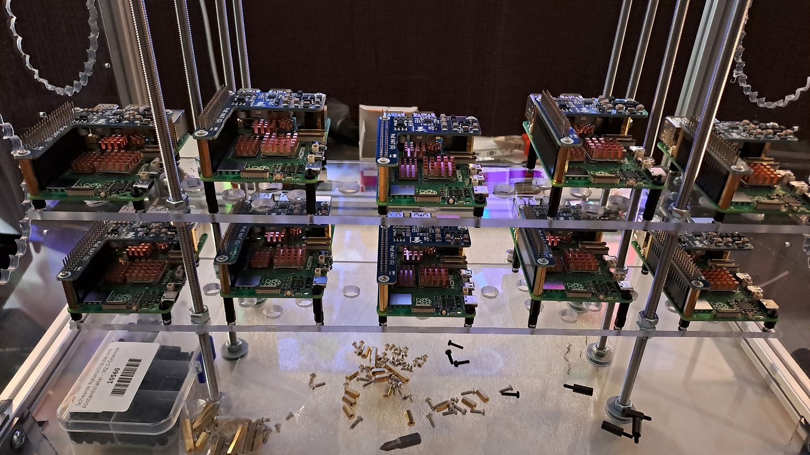
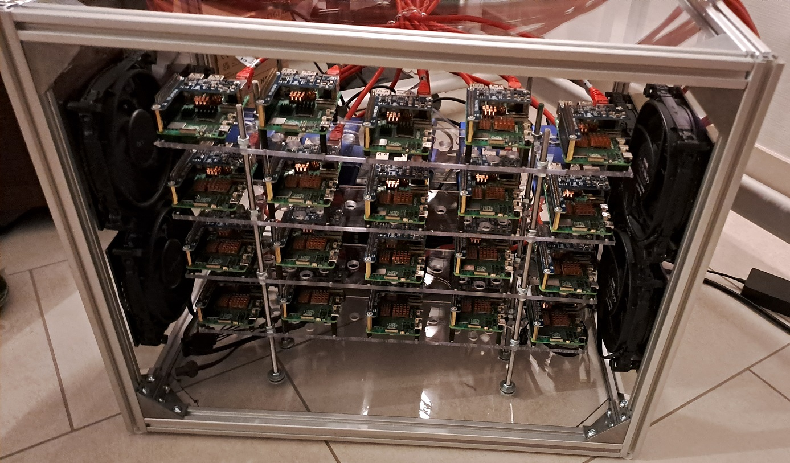
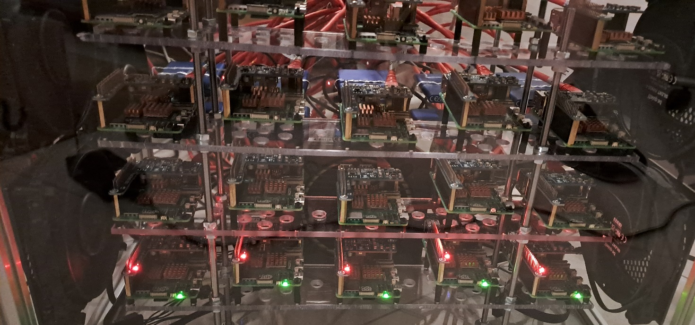
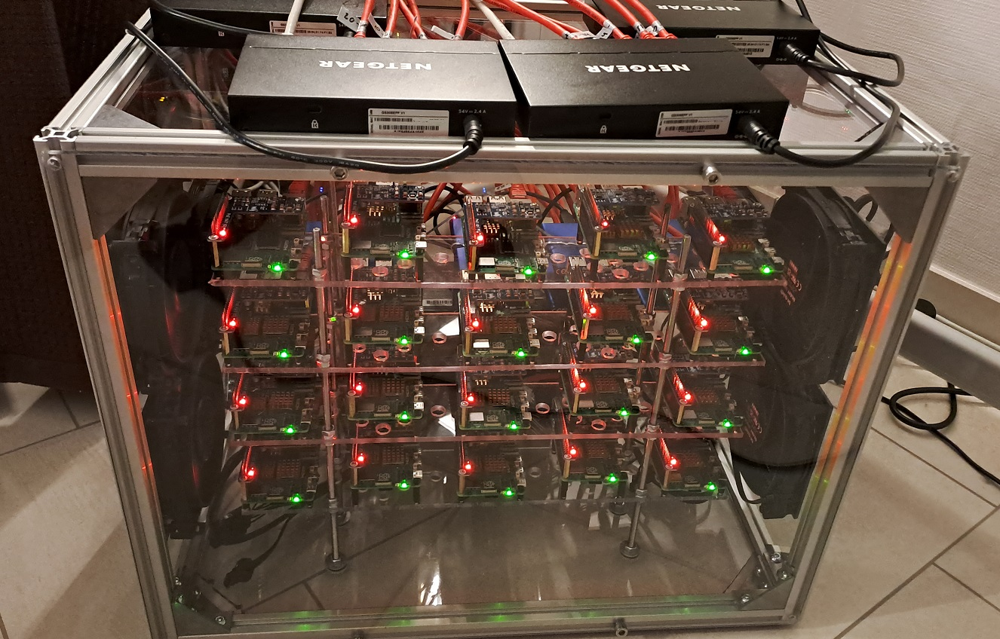
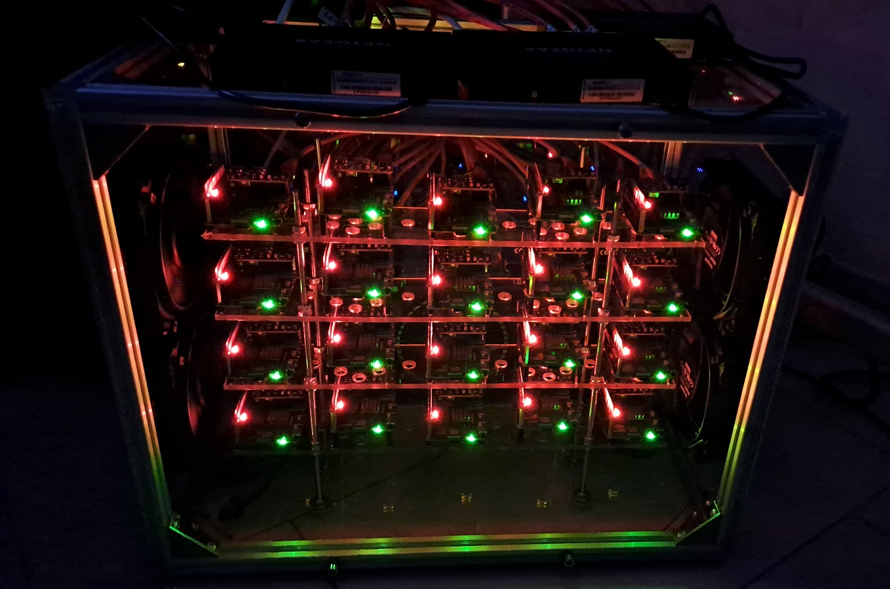

# The Box

I wanted to get all RPIs inside of a box and did not want to buy 19" racks. In addition I wanted some sort of nearly silent cooling and not rely on industrial solutions since I run everything inside of my flat.

So I bought some material and crafted it by hand.

## The Idea

At first I needed to come up with some spatial concepts that would fit not only the RPIs but also the storage drive (at this point I did not even know what type of drives I would order).

To make things easier I roughly sketched an idea in [Blender](https://www.blender.org/).

This was basically the idea and I did also use real-world measurements in the model so I could easily order the correct dimensions of the case.

## Progression

At first I needed to make sure that all RPIs are securely mounted since the ethernet (and USB) ports can develop a significant amount of force when pulled. I decided to have plexiglas lanes with some additional drilled whole to allow for a better air circulation (and heat not to get so much reflected from a solid surface).

A single RPI is screwed into the lane with default spaceholder pins.

To get some disturbance in airflow I varied the height in an A/B pattern (A is lower, B is higher mounted).

In the end it became a solid solution for this specific use-case.

The SSD drives are mounted behind the RPIs in a horizontal pattern to allow air flow from both sides (I will take a better picture ... maybe).

Closed completely it is a neat little box.

At night.

The cable management is a total mess and I still need to find a viable solution without putting too much strain on the ethernet cables. For now it is sufficient.

