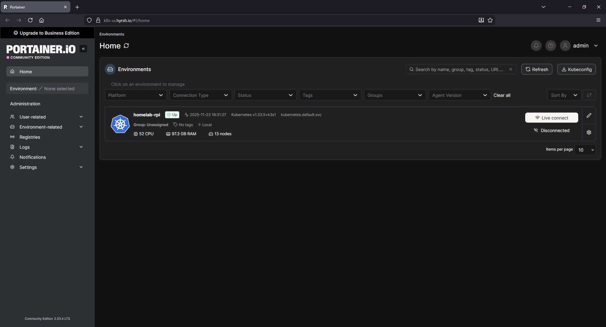
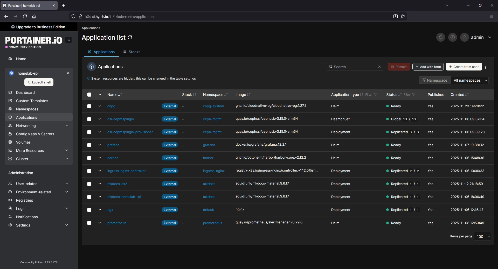

## Info

[Portainer](https://docs.portainer.io/start/install-ce/server/kubernetes/baremetal) is a management tool with a web ui for Kubernetes clusters.

It is integrated with Helm and also provides further features such as application updates via UI or a web-based kubectl shell.

<hr>

## Setup

The setup of Portainer is done via Helm. I added the values.yml file with my settings under /kubernetes/helm-portainer so you can use it as reference.

To install Portainer I used the official helm repo and the namespace "portainer".


```shell
cd kubernetes/helm-portainer

helm repo add portainer https://portainer.github.io/k8s/

helm upgrade -i -n portainer --create-namespace portainer portainer/portainer -f values.yml
```
<hr>

## WebUI

`Cluster`



`Applications`



<hr>
