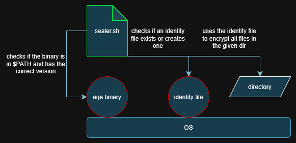

## Baseline

The sealer script does make use of the ["age" binary](https://github.com/FiloSottile/age) and wraps its functionality with some bash logic to ease up general handling.

## Workflow

The script:

- checks the age binary on its version (currently tested v1.3.1)
- looks for an identity file
    - if it is not found it will create one for you (you have to enter a password since the file itself will be encrypted)
- does check before anything happens:
    - if the given directory does contain already encrypted files and a seal attempt is tried --> abort
    - if the given directory does contain plain files and an unseal attempt is tried --> abort
- encrypts the given directories files (no subdirectories) with the identity file
    - the original files get deleted after some checks
- decrypts the given directories files (no subdirectories) with the identity file
    - the encrypted files get deleted after some checks

